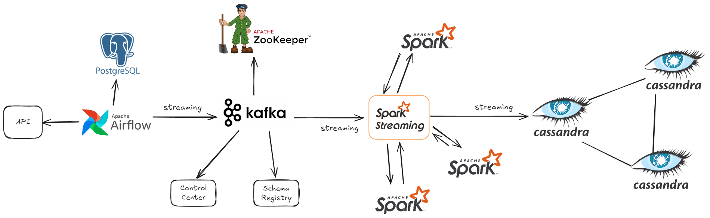

# Introduction

Learm from this video: [Realtime Data Streaming |  End To End Data Engineering Project](https://www.youtube.com/watch?v=GqAcTrqKcrY&t=3s&ab_channel=CodeWithYu)

## Architecture



* Data Source: [Random User Generator | Home](https://randomuser.me/)
* Apache Airflow
* Apache Zookeeper
* Apache Kafka
  * Broker
  * Schema registry
  * Control center
* Apache Spark
  * Master
  * Worker
* Cassandra

## Checklist

**Steps to do**

1. [ ] Get data from the API
2. [ ] Build infrastructure using docker compose
3. [ ] Stream data into Kafka
4. [ ] Process by Spark
5. [ ] Stream data into Cassdra

### Get data from API

* [ ] Using request to get data

### Build infrastructure

* [ ] Zookeeper
* [ ] Kafka
* [ ] Airflow
* [ ] Spark
* [ ] cassandra

### Stream data into Kafka

* [ ] Add Kafka setup to docker-compose
* [ ] Implement Kafka send message code
* [ ] Add Airflow setup to docker-compose

## Apache Spark processing

* [ ] Setup Spark (master and 1 worker)
* [ ] Setup Cassandra

### Stream data into Cassandra

* [ ] Add Spark stream

## Setup

### Environments

```
py -3.11 -m venv .venv

.\.venv\Scripts\activate

python -m pip install -r requirements.txt
```

### API account

[https://randomuser.me/api]()
